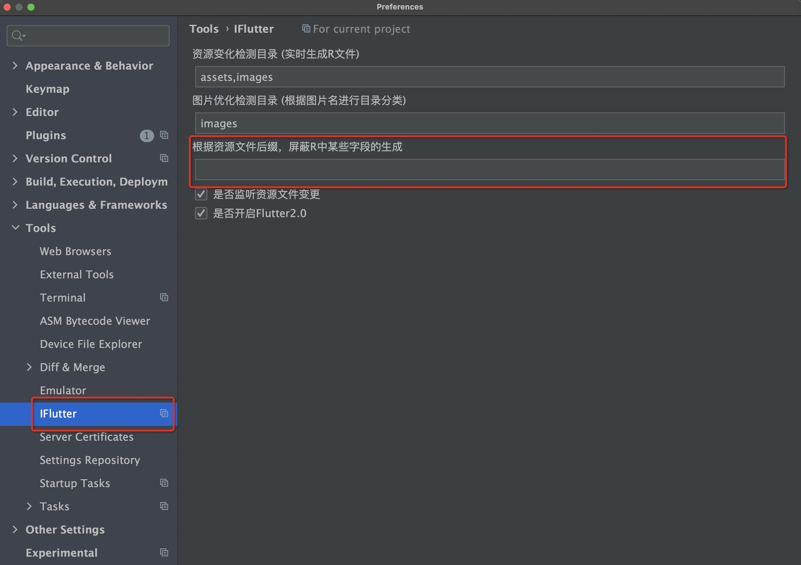
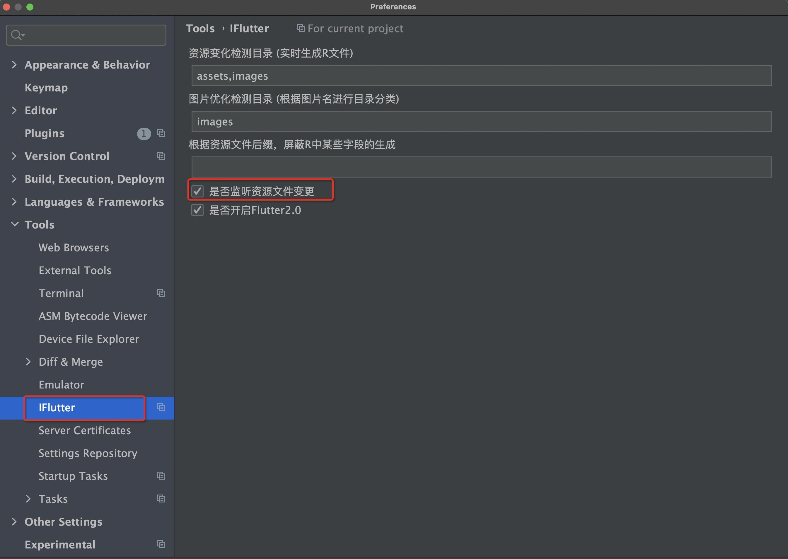
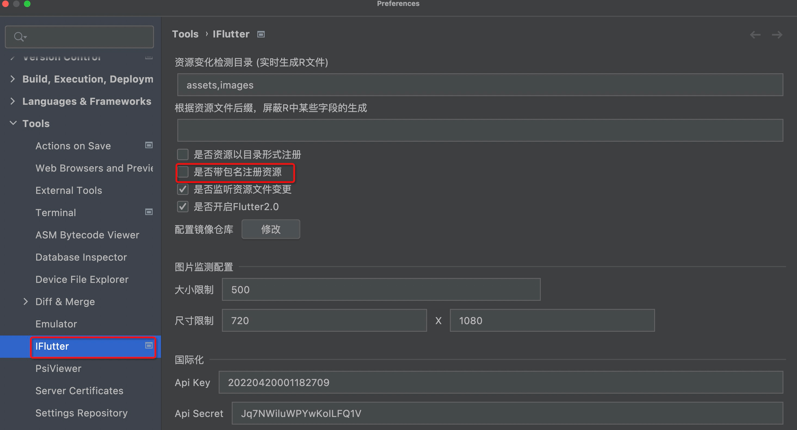

# 注册资源

## 概述

在 Flutter 开发中，使用本地资源是必不可少的。传统的资源使用方式存在以下问题：

- **操作繁琐**：需要手动在 `pubspec.yaml` 中注册每个资源
- **容易出错**：硬编码引用资源路径，容易出现拼写错误
- **维护困难**：资源变更时需要同时修改多个地方

## 传统使用方式

以使用 `bg_login.png` 作为登录界面背景图为例：

**步骤 1：** 在项目根目录创建 `images` 文件夹，并添加 `bg_login.png`

**步骤 2：** 在 `pubspec.yaml` 中注册资源：
```yaml
flutter:
  uses-material-design: true
  assets:
    - images/bg_login.png    # 注册资源
```

**步骤 3：** 在代码中使用资源：
```dart
Image.asset('images/bg_login.png');
```

## iFlutter 解决方案

### 🚀 智能资源管理

`iFlutter` 提供了智能的资源管理功能：

- **自动感知**：当在指定目录中添加、删除、重命名文件时，插件会自动感知变化
- **自动注册**：自动修改 `pubspec.yaml` 文件，无需手动操作
- **代码生成**：自动生成 `_res.dart` 文件（类似 Android 的 R 文件）
- **类型安全**：通过 `R.xx` 方式引用资源，避免硬编码错误


### ⚙️ 配置说明

#### 1. 监听目录配置

指定目录并非固定要求，开发者可以自行配置。默认监听 `images`、`assets` 目录：


#### 2. 生成规则

生成的 `_res.dart` 文件遵循以下规则：

| 监听目录 | 生成文件 | 类名 |
|---------|---------|------|
| `images` | `lib/res/images_res.dart` | `ImagesRes` |
| `assets` | `lib/res/assets_res.dart` | `AssetsRes` |

> 💡 **提示**：当手动修改 `pubspec.yaml` 中的资源配置时，`iFlutter` 也会感知变化并重新生成 `_res.dart` 文件。

#### 3. 忽略字段配置

为了节省包体积和满足特定需求，可以配置某些资源不在 `_res.dart` 文件中生成字段：



- 多个配置使用 `,` 分隔
- 例如：`.json` 文件可以配置为不生成字段

#### 4. 功能开关

如果需要禁用自动资源注册功能，可以在配置中关闭：



---

## Flutter Plugin 项目支持

### 基础功能

对于 `Flutter Plugin` 类型的项目，`iFlutter` 会：

1. 自动将资源注册到 `pubspec.yaml` 中
2. 生成对应的 `_res.dart` 文件

### 使用方式

主项目引入 `Flutter Plugin` 后，使用其中的图片资源：

```dart
// 标准方式
Image.asset(SubModuleRes.LOGIN, package: SubModuleRes.PLUGIN_NAME)
```

### 📦 简化配置

为了简化代码书写，可以开启以下配置来调整资源 R 文件的字段生成规则：



开启后，主项目可以省略 `package` 参数：

```dart
// 简化方式
Image.asset(SubModuleRes.LOGIN)
```

> ⚠️ **注意**：此配置仅适用于 `Flutter Plugin` 类型的项目。
