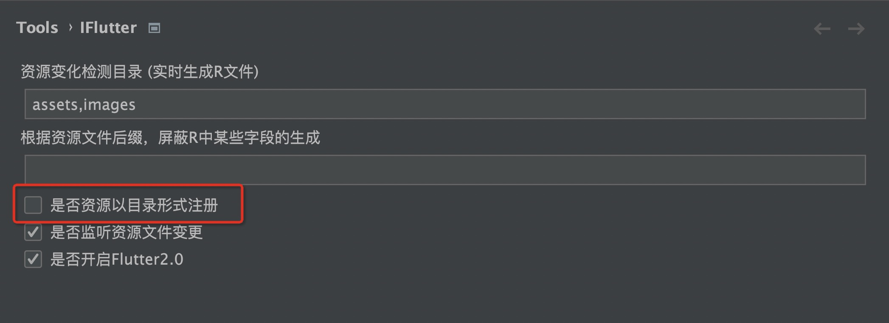

# 注册资源（目录方式）

## 概述

随着项目规模的增长，单个资源文件的注册方式会导致 `pubspec.yaml` 文件变得冗长。为了解决这个问题，`iFlutter` 提供了目录级别的资源注册功能。

## 传统单文件注册方式

按照上一节的说明，`iFlutter` 默认采用单文件注册方式：

```yaml
flutter:
  assets:
    - images/about_a.png
    - images/about_b.png
    - images/about_c.png
    # ... 更多文件
```

## 目录注册方式

### 🔧 配置方法

可以通过以下配置切换到目录注册方式：



### 📝 注册格式

调整资源注册方式后，`iFlutter` 会提示重启 IDE。在下次对资源文件进行增删改操作后（或执行"重置资源"），`pubspec.yaml` 文件会自动调整为目录注册格式：

```yaml
flutter:
  assets:
    - images/
    - assets/
    # ... 其他目录
```

## ⚠️ 重要提醒

### 分辨率资源失效问题

**目录注册方式会导致 dimension（2.0x、3.0x...）失效**，这是 Flutter 对资源处理方式的限制，并非 `iFlutter` 导致的问题。

**问题说明：**

假设有以下文件夹结构：
```
images/
├── about.png          # 1.0x 资源
└── 3.0x/
    └── about.png      # 3.0x 资源
```

当使用目录注册方式时：
- 资源路径：`images/about.png`
- **问题**：在任何分辨率的设备上，都无法正确使用 `3.0x` 目录下的高分辨率资源

### 📋 选择建议

| 注册方式 | 优点 | 缺点 | 适用场景 |
|---------|------|------|---------|
| **单文件注册** | 支持多分辨率资源 | `pubspec.yaml` 文件较长 | 需要多分辨率适配的项目 |
| **目录注册** | `pubspec.yaml` 文件简洁 | 不支持多分辨率资源 | 不需要多分辨率适配的项目 |

> 💡 **建议**：如果项目需要支持多分辨率资源（如 2.0x、3.0x），建议使用单文件注册方式。
