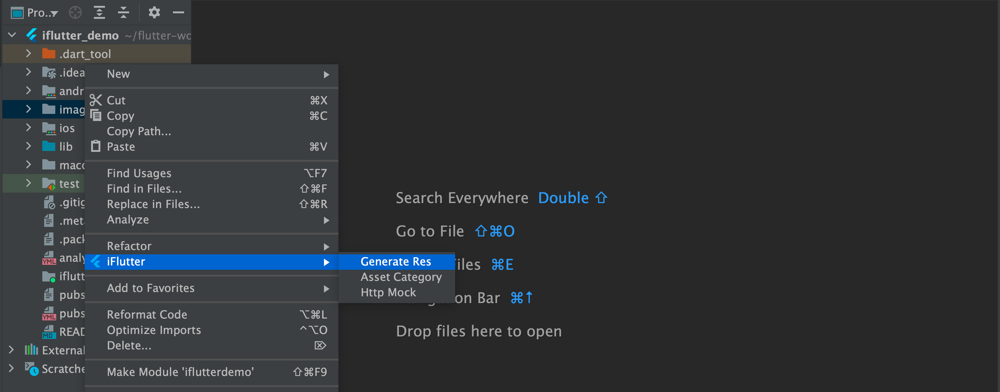

# 重置资源

## 概述

在代码合并或资源文件冲突时，可能需要重新生成资源相关文件。`iFlutter` 提供了便捷的资源重置功能。

## 🔄 使用场景

### 常见问题场景

- **代码合并冲突**：合并分支时 `_res.dart`、`i_font_res.dart` 文件出现冲突
- **资源文件丢失**：意外删除或损坏了自动生成的资源文件
- **配置不同步**：手动修改 `pubspec.yaml` 后，生成的代码文件未同步更新

## 🛠️ 重置操作

### 操作入口

通过以下方式访问资源重置功能：

### 重置步骤

`iFlutter` 执行资源重置时会按照以下步骤进行：

1. **重新扫描**：扫描所有指定目录中的资源文件
2. **更新配置**：将资源重新注册到 `pubspec.yaml` 中
3. **重新生成**：重新生成 `_res.dart` 和 `i_font_res.dart` 文件

## 📋 重置内容

| 重置内容 | 说明 |
|---------|------|
| `pubspec.yaml` | 重新注册所有监听目录中的资源 |
| `_res.dart` | 重新生成资源引用代码 |
| `i_font_res.dart` | 重新生成字体引用代码 |

> 💡 **提示**：重置操作是安全的，不会影响项目中的其他文件，只会重新生成资源相关的配置和代码文件。
