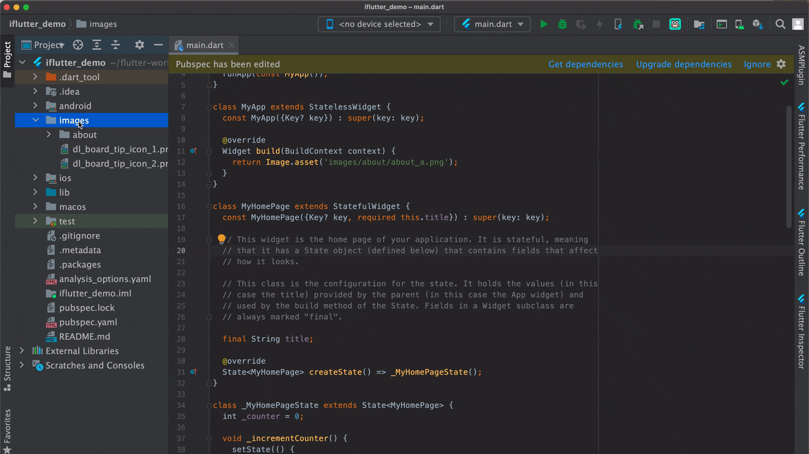

# 检查重复资源

## 概述

在项目开发过程中，特别是多人协作的团队项目中，同一个设计资源可能被不同的开发者重复引入，导致应用包体积不必要的增长。`iFlutter` 提供了智能的重复资源检测功能，帮助开发者及时发现和清理重复资源。

## 🔍 重复资源检测

### 检测场景

- **多人协作**：不同开发者可能添加了相同的资源文件
- **版本迭代**：新版本开发时可能重复引入旧版本的资源
- **模块合并**：合并不同模块时可能存在重复的资源文件

### 检测原理

`iFlutter` 通过以下方式检测重复资源：

1. **文件内容对比**：比较文件的 MD5 值或内容哈希
2. **文件名相似性**：检测文件名相似但路径不同的资源
3. **尺寸规格对比**：识别相同尺寸但命名不同的图片资源

## 🛠️ 使用方法

### 操作步骤

通过以下方式启动重复资源检测：

### 检测结果

检测完成后，系统会展示：

- **重复资源列表**：显示所有检测到的重复资源
- **文件路径对比**：展示重复资源的具体位置

## 📊 优化效果

- **代码整洁**：避免资源引用混乱
- **团队协作**：统一资源管理规范

> ⚠️ **注意**：删除重复资源前，请确认该资源确实不再使用，避免误删导致的问题。
