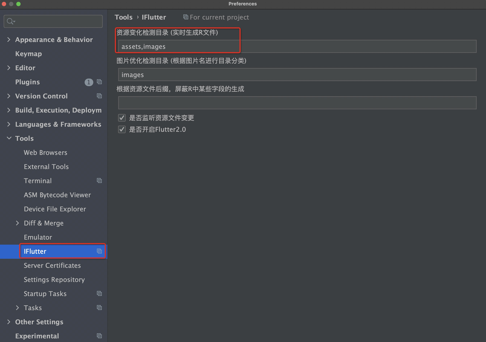

# 归纳资源

## 概述

随着 Flutter 项目的不断迭代，资源文件数量会快速增长。当所有资源文件都平展在同一目录下时，会给项目维护带来困难。`iFlutter` 提供了智能的资源归纳功能，帮助开发者按照模块对资源进行分类整理。

## 📁 资源归纳前后对比

### 归纳前：平展结构

```
images/
├── login_wx.png
├── login_qq.png
├── login_phone.png
├── mine_setting.png
├── mine_default_portrait.png
├── launcher.png
└── ...
```

### 归纳后：模块化结构

```
images/
├── login/
│   ├── login_wx.png
│   ├── login_qq.png
│   └── login_phone.png
├── mine/
│   ├── mine_setting.png
│   └── mine_default_portrait.png
├── launcher.png
└── ...
```

## 🔧 归纳规则

### 分类依据

`iFlutter` 以 `_` 为分隔符进行资源分类：

- **规则**：`模块名_具体名称.扩展名`
- **示例**：`login_wx.png` → 归纳到 `login` 文件夹

### 归纳逻辑

| 文件名 | 归纳结果 | 说明 |
|--------|---------|------|
| `login_wx.png` | `login/login_wx.png` | 按前缀分类 |
| `mine_setting.png` | `mine/mine_setting.png` | 按前缀分类 |
| `launcher.png` | `launcher.png` | 无前缀，保持原位置 |

## ⚙️ 配置说明

### 支持目录配置

并非所有目录都支持资源归纳，需要在配置中指定：



**默认支持目录：**
- `assets`
- `images`

**自定义配置：**
- 开发者可以根据项目需求调整支持的目录

## 🚀 使用效果

### 操作演示


### 自动化处理

归纳完成后，`iFlutter` 会自动执行以下操作：

1. **重新注册**：将归纳后的资源重新注册到 `pubspec.yaml` 中
2. **更新代码**：重新生成 `_res.dart` 文件，确保资源引用正确
3. **路径更新**：自动更新所有相关的资源引用路径

## 📋 使用建议

### 最佳实践

- **命名规范**：建议团队统一资源命名规范，使用 `模块_功能` 的格式
- **定期整理**：定期使用归纳功能整理项目资源
- **版本控制**：归纳操作前建议提交代码，以便出现问题时回滚

### 注意事项

- **测试验证**：归纳后需要测试确保所有资源引用正常
- **团队协作**：团队开发时需要协调好归纳时机，避免冲突

> 💡 **建议**：建议在项目初期就建立良好的资源命名和组织规范，这样可以更好地发挥归纳功能的作用。
