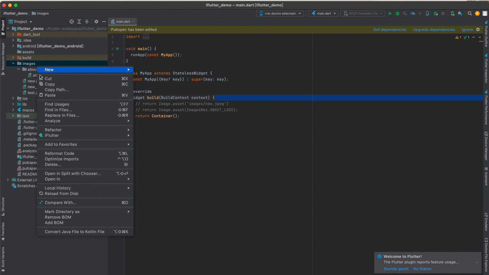

# 检查无用资源

## 概述

随着项目的不断迭代和功能调整，源工程中可能会遗留一些不再使用的资源文件，这些无用资源会不必要地增加应用包体积。`iFlutter` 提供了便捷的无用资源检测功能，帮助开发者快速识别和清理这些冗余文件。

## 🔍 无用资源检测

### 检测原理

`iFlutter` 通过以下方式检测无用资源：

1. **代码扫描**：扫描项目中所有的 Dart 文件，查找资源引用
2. **配置分析**：分析 `pubspec.yaml` 中注册的资源
3. **交叉对比**：对比已注册但未被引用的资源文件

### 检测范围

- **图片资源**：`.png`、`.jpg`、`.jpeg`、`.svg`、`.webp` 等
- **字体资源**：`.ttf`、`.otf`、`.woff` 等
- **其他资源**：`.json`、`.txt`、`.xml` 等各类资源文件

## 🛠️ 使用方法

### 操作步骤

通过菜单或快捷方式启动无用资源检测：



## ⚠️ 特殊情况

### 动态引用

某些资源可能通过动态字符串拼接的方式引用，这类引用可能无法被静态分析检测到：

```dart
// 动态引用示例
String imageName = 'login_' + type + '.png';
Image.asset('images/' + imageName);
```

对于这类情况，建议：
- 在删除前仔细检查代码
- 保留可能被动态引用的资源
- 建立团队的资源使用规范

> 💡 **建议**：建议结合代码审查和测试验证，确保删除的资源确实不再使用。
