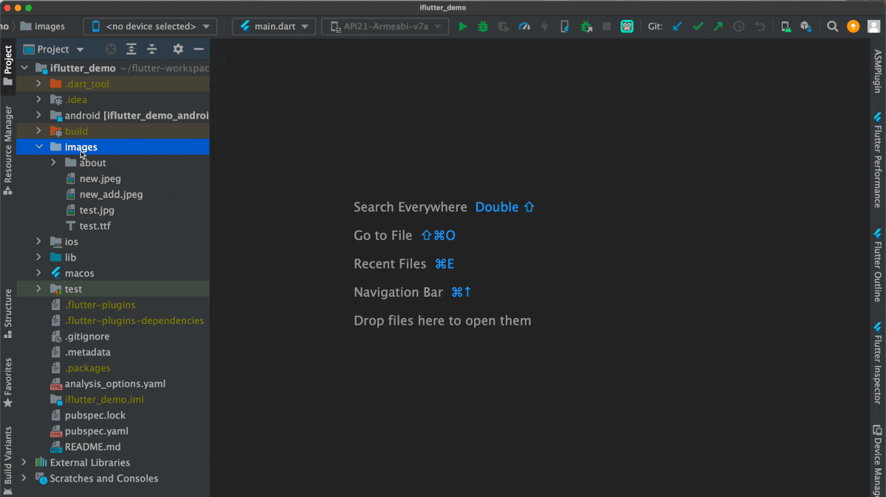
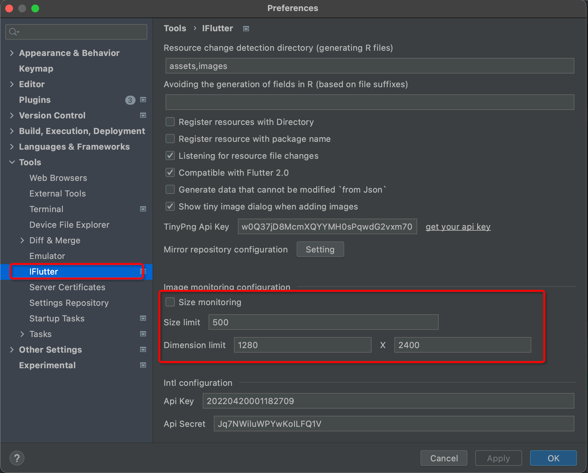

# 监控图片资源

## 概述

为了避免添加过大的图片资源导致应用包体积过度增长，或者因为大图片引起的内存溢出（OOM）等问题，`iFlutter` 提供了智能的图片资源监控功能，在添加图片时进行实时检测和提醒。

## 🖼️ 图片大小监控

### 监控机制

`iFlutter` 会监听图片资源的添加事件，当新引入的图片资源超过设定阈值时，会通过弹窗形式进行提醒：

### 检测维度

图片监控包含以下两个维度：

1. **文件大小**：检测图片文件的存储大小
2. **图片尺寸**：检测图片的像素尺寸（宽度 × 高度）

## ⚙️ 配置说明

### 自定义配置

考虑到不同项目对资源控制的严格程度不同，`iFlutter` 提供了灵活的配置选项：

### 默认配置

| 约束条件 | 默认值 | 说明 |
|---------|-------|------|
| **最大文件大小** | 500K | 超过此大小会触发提醒 |
| **最大图片尺寸** | 1280 x 2400 | 超过此尺寸会触发提醒 |

### 配置选项

- **启用/禁用**：可以完全关闭图片监控功能
- **阈值调整**：根据项目需求调整大小和尺寸阈值

## 🗜️ 图片压缩功能

### 压缩提醒

除了检测图片大小，`iFlutter` 还提供智能的图片压缩建议：

### 启用条件

图片压缩功能需要满足以下条件才能激活：

1. **配置 Tiny Key**：在设置中配置 TinyPNG API Key
2. **启用选项**：勾选 "Show tiny image dialog..." 选项

### 压缩服务

- **服务提供商**：使用 [TinyPNG](https://tinypng.com/) 提供的压缩服务
- **支持格式**：支持 `.jpg`、`.jpeg`、`.png`、`.webp` 格式
- **压缩质量**：智能压缩，在保证视觉质量的前提下最大化减少文件大小

## 💡 TinyPNG 使用说明

### 获取 API Key

1. 访问 [TinyPNG 开发者页面](https://tinypng.com/developers)
2. 注册账号并获取免费的 API Key
3. 在 `iFlutter` 配置中填入 API Key

### 使用限制

- **免费额度**：每月可免费压缩 500 张图片
- **付费方案**：超出免费额度后需要付费使用
- **建议策略**：优先对单张图片进行压缩，避免批量操作消耗额度

> ⚠️ **注意**：由于 TinyPNG 每月免费压缩数量有限，建议优先通过右键菜单对单张图片进行压缩，避免批量操作快速消耗免费额度。