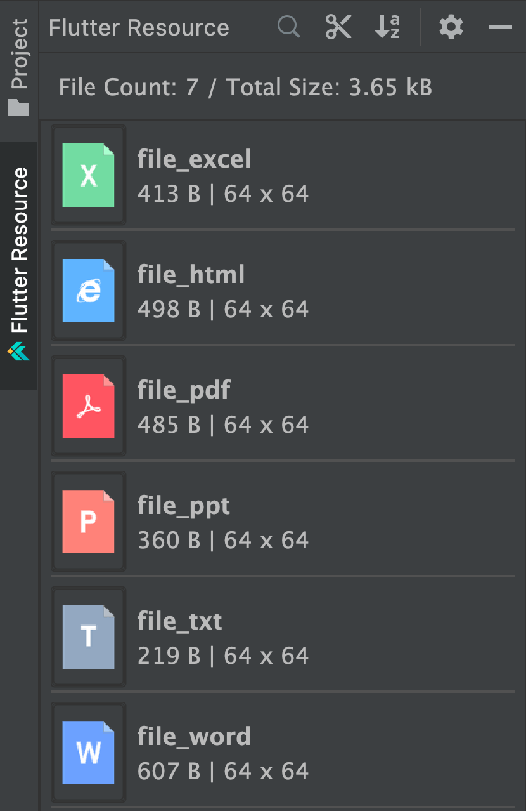
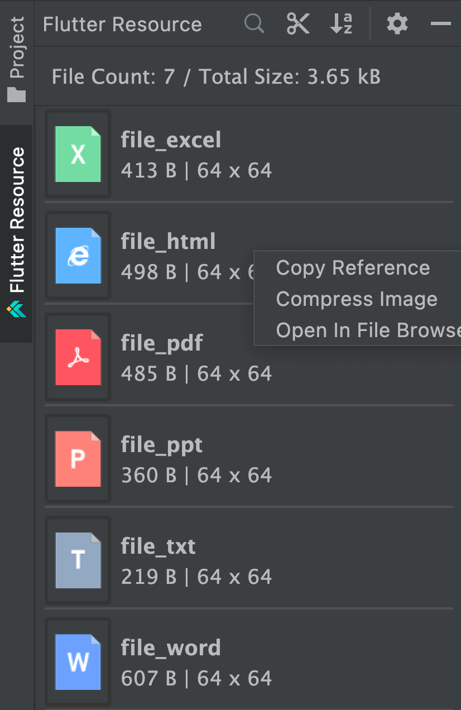

# 管理图片资源

## 概述

在 Android 原生开发中，Android Studio 提供了便捷的 `Resource Manager` 左侧工具栏，让开发者能够轻松预览项目中的所有资源文件。然而，Flutter 官方插件缺少这一功能。`iFlutter` 成功填补了这一空白，为 Flutter 开发者提供了完整的图片资源管理解决方案。

## 🖼️ Flutter Resource 工具栏

### 界面展示

### 支持的图片格式

`Flutter Resource` 工具栏可识别以下图片格式：

| 格式 | 说明 |
|------|------|
| `.jpg` | JPEG 图片格式 |
| `.jpeg` | JPEG 图片格式（完整扩展名） |
| `.png` | PNG 图片格式 |
| `.svg` | 可缩放矢量图形 |
| `.webp` | WebP 图片格式 |

## 🛠️ 顶部工具栏功能

### 1. 🎯 资源定位

**功能描述：** 快速定位当前在 IDE 中打开的图片文件

**使用场景：** 当在代码编辑器中查看图片引用时，可以快速在资源管理器中定位到对应的图片文件

### 2. 🔍 搜索功能

**功能描述：** 在资源管理器中搜索图片文件

**快捷键：**
- `Ctrl/Cmd + F`：开始搜索
- `ESC`：退出搜索模式

**使用技巧：** 支持按文件名、路径等条件进行模糊搜索

### 3. 🗜️ 批量压缩

**功能描述：** 使用 [TinyPNG](https://tinypng.com/) 对图片进行批量压缩

**支持格式：** `.jpg`、`.jpeg`、`.png`、`.webp`

**使用前提：**
1. 需要在 [TinyPNG 开发者页面](https://tinypng.com/developers) 获取 API Key
2. 在 `iFlutter` 配置中填入 API Key

**⚠️ 重要提醒：** TinyPNG 每月免费压缩数量有限，建议优先使用右键菜单对单张图片进行压缩

### 4. 📊 排序功能

**排序选项：**
- **文件更新时间排序**（默认）：按最近修改时间排序
- **文件名称排序**：按文件名字母顺序排序
- **文件大小排序**：按文件大小从大到小或从小到大排序

---

## 📋 右键菜单功能

### 1. 📋 拷贝引用

**功能描述：** 直接复制资源的代码引用

**示例输出：** `ImagesRes.LOGIN_ICON`

**使用场景：** 在编写代码时快速获取资源引用，避免手动输入

### 2. 📁 拷贝路径

**功能描述：** 直接复制资源的文件路径

**示例输出：** `assets/login_icon.png`

**使用场景：** 需要使用 `Image.asset()` 方法时快速获取路径

### 3. 🗜️ 压缩图片

**功能描述：** 对单张图片进行压缩优化

**支持格式：** `.jpg`、`.jpeg`、`.png`、`.webp`

**压缩服务：** 使用 [TinyPNG](https://tinypng.com/) 提供的压缩服务

**优势：** 相比批量压缩，单张压缩更节省 API 调用次数

### 4. 🗑️ 删除图片

**功能描述：** 安全删除图片资源

**智能分析：** 删除前会自动分析文件的引用情况

**安全提醒：** 如果检测到文件被引用，会提示用户确认删除操作

### 5. 📂 打开图片

**功能描述：** 在系统文件管理器中打开图片所在目录

**使用场景：** 需要查看图片的详细属性或进行系统级操作时

> 💡 **提示**：结合使用资源管理器的各项功能，可以大大提升 Flutter 项目中图片资源的管理效率和质量。
