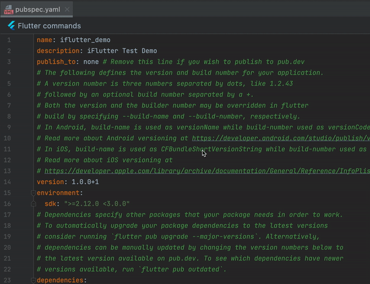

# 清除注释

## 概述

在基于模板创建新的 Flutter Plugin 时，模板代码中往往包含大量示例注释。逐行手动删除这些注释既繁琐又耗时。`iFlutter` 提供了一键清除注释的功能，支持 `Dart` 和 `YAML` 文件，让代码库保持整洁。

## 🧹 支持的文件类型

| 文件类型 | 说明 |
|---------|------|
| `.dart` | 清除 `//` 单行注释和 `/* */` 多行注释 |
| `.yaml` / `.yml` | 清除 `#` 注释行 |

## 🛠️ 使用方式

### 操作演示

在目标文件或目录上右键，选择对应的清除注释选项：

## 📋 适用场景

- 基于官方模板创建新 Flutter Plugin 后，快速清理模板注释
- 提交代码前清理开发过程中的临时调试注释
- 规范化整理遗留项目中的注释风格
