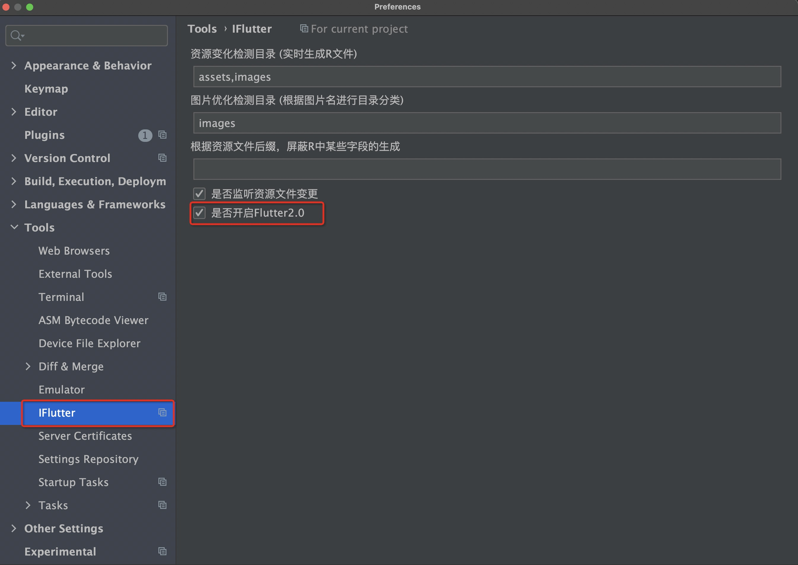

# JSON 转 Dart Entity

## 概述

在 Flutter 开发中，处理 JSON 数据是日常开发的重要环节。手动编写 Dart 实体类不仅耗时，还容易出错。`iFlutter` 提供了强大的 JSON 转 Dart Entity 功能，能够快速、准确地将 JSON 数据转换为 Dart 实体类。

## 🚀 功能特性

### 智能转换

- **自动类型推导**：根据 JSON 数据自动推导 Dart 数据类型
- **嵌套对象支持**：支持复杂的嵌套 JSON 结构
- **数组处理**：智能处理 JSON 数组，生成对应的 List 类型
- **空安全支持**：生成符合 Dart 空安全规范的代码

### 使用限制

该功能仅在 Flutter 项目的 `lib` 目录及其子目录下可用，确保生成的文件位于正确的源码目录中。

## 🛠️ 使用方法

### 操作演示


### 使用步骤

1. **选择位置**：在 `lib` 目录或其子目录中右键选择创建位置
2. **输入 JSON**：在弹出的对话框中粘贴 JSON 数据
3. **设置类名**：输入要生成的 Dart 类名（建议使用驼峰命名法）
4. **生成代码**：点击确认，自动生成 Dart 实体类文件

## ⚙️ 配置说明

### 空安全配置

默认情况下，生成的 Dart 实体类支持空安全特性。如果项目尚未迁移到 Flutter 2.x 版本，可以通过配置调整：



### 配置选项

- **启用空安全**：生成符合 Dart 空安全规范的代码
- **禁用空安全**：生成兼容旧版本 Dart 的代码

## 📝 命名规范

### 类名命名

建议使用 **驼峰命名法（PascalCase）** 来命名生成的类：

| 推荐 ✅ | 不推荐 ❌ |
|---------|----------|
| `UserInfo` | `userinfo` |
| `ProductDetail` | `product_detail` |
| `ApiResponse` | `api-response` |

### 字段命名

生成的字段名会根据 JSON 键名自动转换：

| JSON 键名 | Dart 字段名 | 说明 |
|-----------|-------------|------|
| `user_name` | `userName` | 下划线转驼峰 |
| `user-id` | `userId` | 连字符转驼峰 |
| `UserAge` | `userAge` | 首字母小写 |

## 🎯 生成示例

### 输入 JSON

```json
{
  "id": 1,
  "name": "John Doe",
  "email": "john@example.com",
  "age": 30,
  "is_active": true,
  "profile": {
    "avatar": "https://example.com/avatar.jpg",
    "bio": "Software Developer"
  },
  "skills": ["Flutter", "Dart", "JavaScript"]
}
```

### 生成的 Dart 代码

```dart
class User {
  int? id;
  String? name;
  String? email;
  int? age;
  bool? isActive;
  Profile? profile;
  List<String>? skills;

  User({
    this.id,
    this.name,
    this.email,
    this.age,
    this.isActive,
    this.profile,
    this.skills,
  });

  User.fromJson(Map<String, dynamic> json) {
    id = json['id'];
    name = json['name'];
    email = json['email'];
    age = json['age'];
    isActive = json['is_active'];
    profile = json['profile'] != null 
        ? Profile.fromJson(json['profile']) 
        : null;
    skills = json['skills']?.cast<String>();
  }

  Map<String, dynamic> toJson() {
    final Map<String, dynamic> data = <String, dynamic>{};
    data['id'] = id;
    data['name'] = name;
    data['email'] = email;
    data['age'] = age;
    data['is_active'] = isActive;
    if (profile != null) {
      data['profile'] = profile!.toJson();
    }
    data['skills'] = skills;
    return data;
  }
}

class Profile {
  String? avatar;
  String? bio;

  Profile({this.avatar, this.bio});

  Profile.fromJson(Map<String, dynamic> json) {
    avatar = json['avatar'];
    bio = json['bio'];
  }

  Map<String, dynamic> toJson() {
    final Map<String, dynamic> data = <String, dynamic>{};
    data['avatar'] = avatar;
    data['bio'] = bio;
    return data;
  }
}
```
