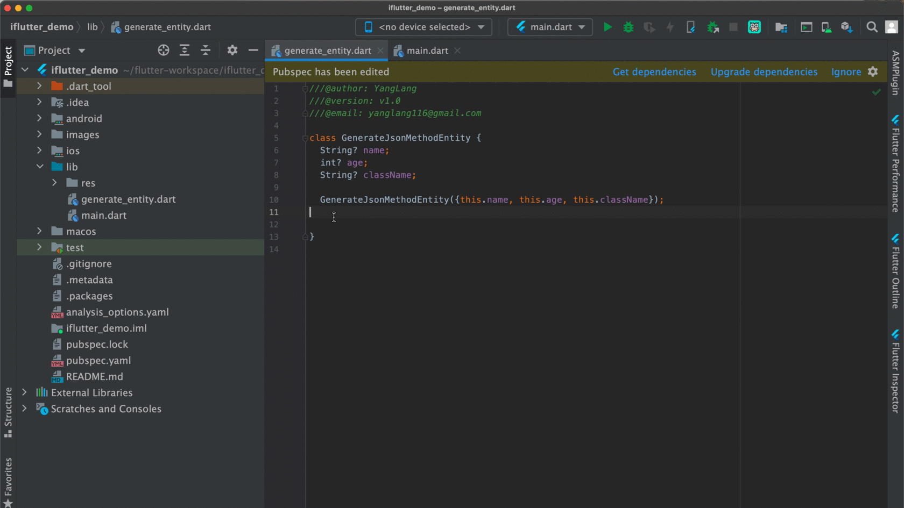

# 生成 fromJson、toJson 方法

## 概述

通过上一节的 JSON 转 Dart Entity 工具，我们可以快速创建新的实体类。但对于项目中已有的实体类，如何为它们添加 JSON
序列化和反序列化方法呢？`iFlutter` 提供了便捷的 `fromJson` 和 `toJson` 方法生成功能。

## 🚀 功能特性

### 智能补全

- **自动分析**：自动分析现有类的字段结构
- **类型适配**：根据字段类型生成相应的序列化逻辑
- **嵌套支持**：支持嵌套对象和复杂数据结构
- **空安全**：生成符合空安全规范的代码

### 与官方插件的关系

Dart 官方插件已经提供了生成 `Constructor`、`Named Constructor` 和 `toString` 方法的功能，而 `iFlutter` 的 `fromJson` 和
`toJson` 方法生成功能正好补充了官方插件在 JSON 序列化方面的空白。

## 🛠️ 使用方法

### 操作演示



### 使用步骤

1. **打开文件**：打开包含 Dart 实体类的文件
2. **定位类**：将光标放在需要生成方法的类中
3. **触发生成**：使用快捷键或右键菜单选择生成选项
4. **选择方法**：选择要生成的方法（`fromJson`、`toJson` 或两者）
5. **自动生成**：系统自动生成相应的方法代码

## 📝 生成示例

### 原始类定义

```dart
class User {
  int? id;
  String? name;
  String? email;
  bool? isActive;
  List<String>? skills;
  Profile? profile;
  
  User({
    this.id,
    this.name,
    this.email,
    this.isActive,
    this.skills,
    this.profile,
  });
}

class Profile {
  String? avatar;
  String? bio;
  
  Profile({this.avatar, this.bio});
}
```

### 生成 fromJson 方法

```dart
factory User.fromJson(Map<String, dynamic> json) {
  return User(
    id: json['id'],
    name: json['name'],
    email: json['email'],
    isActive: json['isActive'],
    skills: json['skills']?.cast<String>(),
    profile:json['profile'] == null ? null : Profile.fromJson(json['profile']),
  );
}
```

### 生成 toJson 方法

```dart
Map<String, dynamic> toJson() => {
    'id': id,
    'name': name,
    'email': email,
    'isActive': isActive,
    'skills': skills,
    'profile': profile?.toJson(),
};
```

## 🎯 支持的数据类型

### 基础数据类型

| Dart 类型  | JSON 类型   | 处理方式 |
|----------|-----------|------|
| `int`    | `number`  | 直接赋值 |
| `double` | `number`  | 直接赋值 |
| `String` | `string`  | 直接赋值 |
| `bool`   | `boolean` | 直接赋值 |

### 复杂数据类型

| Dart 类型                | 处理方式                         |
|------------------------|------------------------------|
| `List<T>`              | 使用 `cast<T>()` 进行类型转换        |
| `Map<String, dynamic>` | 直接赋值                         |
| `自定义对象`                | 调用对象的 `fromJson`/`toJson` 方法 |
| `可空类型`                 | 添加空值检查                       |

