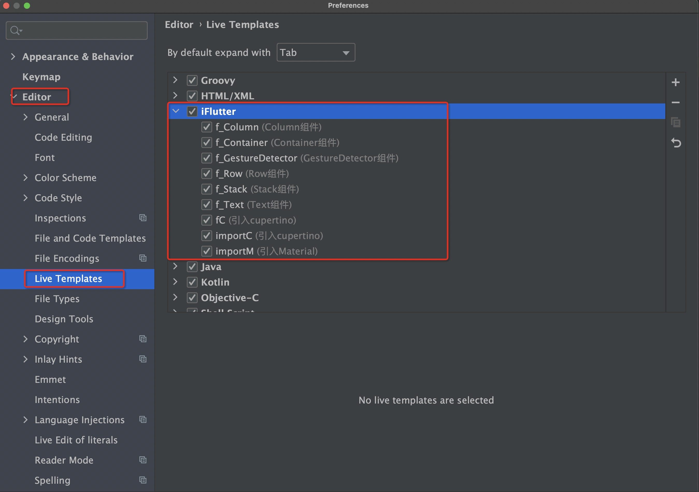

# 提供 Live Template

## 概述

Live Template（实时模板）是 IntelliJ IDEA 系列 IDE 提供的强大功能，可以通过简短的缩写快速插入常用的代码片段。`iFlutter` 为 Flutter 开发提供了一套精心设计的 Live Template，大大提升开发效率。

## 🚀 功能特性

### 快速编码

- **即时插入**：输入缩写后按 Tab 键即可插入完整代码
- **智能补全**：自动定位光标到需要修改的位置
- **参数提示**：支持多个参数位置的快速切换
- **语法高亮**：插入的代码保持完整的语法高亮

## 🛠️ 使用方法

### 操作演示


### 使用步骤

1. **输入缩写**：在代码编辑器中输入对应的缩写
2. **触发插入**：按 `Tab` 键或 `Enter` 键触发模板插入
3. **编辑参数**：使用 `Tab` 键在参数之间切换
4. **完成编辑**：按 `Escape` 键或点击其他位置完成编辑

## 📋 内置模板列表

### 导入语句

| 缩写 | 生成代码 | 说明 |
|------|---------|------|
| `importM` | `import 'package:flutter/material.dart';` | 导入 Material 设计库 |
| `importC` | `import 'package:flutter/cupertino.dart';` | 导入 Cupertino 设计库 |

### 常用组件

| 缩写 | 生成代码 | 说明 |
|------|---------|------|
| `f_Column` | `Column(...)` | 创建垂直布局组件 |
| `f_Container` | `Container(...)` | 创建容器组件 |
| `f_GestureDetector` | `GestureDetector(...)` | 创建手势检测组件 |
| `f_Row` | `Row(...)` | 创建水平布局组件 |
| `f_Stack` | `Stack(...)` | 创建堆叠布局组件 |
| `f_Text` | `Text(...)` | 创建文本组件 |

## 🔧 模板详情

### 配置界面



### 模板结构

每个 Live Template 都包含以下要素：

- **缩写**：触发模板的简短文本
- **描述**：模板的功能说明
- **模板文本**：要插入的代码内容
- **变量**：可编辑的参数位置
- **上下文**：模板的适用范围

## 📝 使用示例

### Column 组件示例

**输入：** `f_Column` + `Tab`

**生成代码：**
```dart
Column(
  children: [
    $CHILD$
  ],
)
```

**使用说明：**
- 光标自动定位到 `$CHILD$` 位置
- 可以直接输入子组件代码
- 按 `Tab` 键可以跳转到下一个参数位置

### Container 组件示例

**输入：** `f_Container` + `Tab`

**生成代码：**
```dart
Container(
  width: $WIDTH$,
  height: $HEIGHT$,
  child: $CHILD$,
)
```

**使用说明：**
- 按 `Tab` 键依次编辑宽度、高度和子组件
- 每个参数都有默认的占位符
- 可以根据需要删除不需要的参数

## 🎯 自定义模板

### 创建自定义模板

1. **打开设置**：`File` → `Settings` → `Editor` → `Live Templates`
2. **选择分组**：选择 `Flutter` 分组或创建新分组
3. **添加模板**：点击 `+` 号添加新的 Live Template
4. **配置模板**：设置缩写、描述和模板文本
5. **设置上下文**：选择模板的适用范围

### 模板语法

Live Template 支持以下语法：

- `$VARIABLE$`：定义可编辑变量
- `$VARIABLE_NAME$`：带名称的变量
- `$END$`：定义编辑完成后光标的最终位置

### 示例模板

```dart
// 自定义 StatefulWidget 模板
class $CLASS_NAME$ extends StatefulWidget {
  @override
  _$CLASS_NAME$State createState() => _$CLASS_NAME$State();
}

class _$CLASS_NAME$State extends State<$CLASS_NAME$> {
  @override
  Widget build(BuildContext context) {
    return $WIDGET$;
  }
}
```

