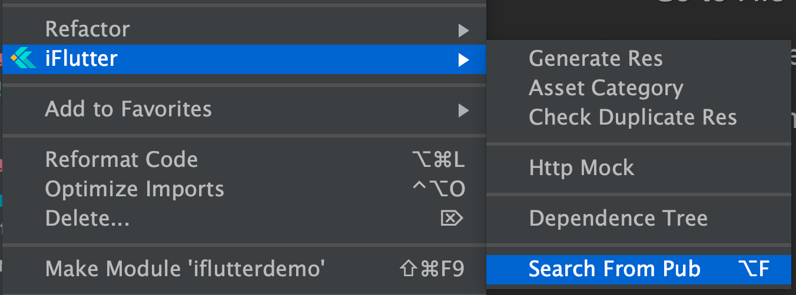
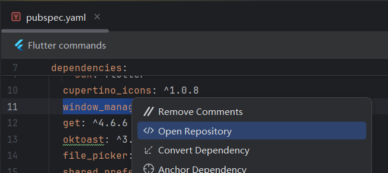

# 搜索 Pub

## 概述
在 Flutter 开发中，搜索、选择和浏览插件是开发者日常工作中必不可少的操作。传统方式下，开发者需先打开浏览器，访问 [pub.dev](https://pub.dev) 网站，再进行插件搜索，整个流程不仅步骤较多，还需要在 IDE 与浏览器之间频繁切换，颇为繁琐。

而 `iFlutter` 提供一键搜索功能，简化这一过程，极大提升了操作效率。

## 搜索插件

### 快捷键

| 操作系统 | 快捷键 |
|---------|--------|
| **macOS** | `Option + F` |
| **Windows/Linux** | `Alt + F` |

## 浏览插件

