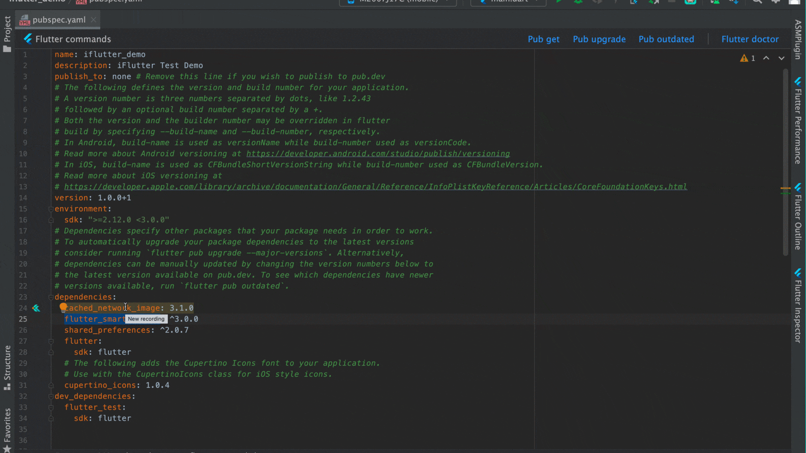

# 定位依赖

## 概述

在 Flutter 开发过程中，经常需要查看第三方插件的源代码实现，以便更好地理解其工作原理或进行问题排查。`iFlutter` 提供了便捷的依赖定位功能，让开发者能够快速索引并定位到指定依赖的代码实现。

### 使用前提

在使用依赖定位功能之前，需要确保已经成功执行了 `flutter pub get` 命令，这样才能确保所有依赖都已正确下载和配置。

## 🛠️ 使用方法

### 操作演示

