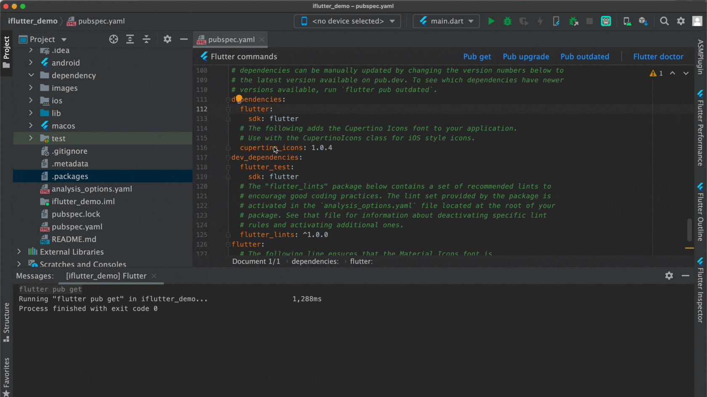
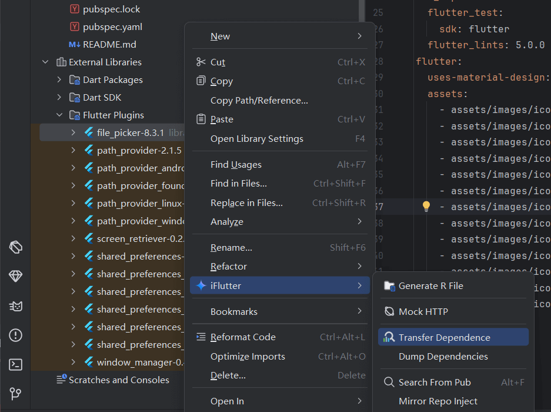

# 提取依赖

## 概述

在 Flutter 开发过程中，有时需要对第三方插件进行定制化修改或功能扩展。将远程依赖转换为本地依赖是一个常见的需求，它允许开发者直接修改插件源码，实现更灵活的功能定制。`iFlutter` 提供了一键转换功能，让这个过程变得简单高效。


## 🛠️ 使用方法

### 操作演示



### 使用步骤

1. **定位依赖**：在 `pubspec.yaml` 文件中找到要转换的依赖
2. **右键操作**：将光标停留在对应的包名上，右键选择 `Convert to Local Dependency`
3. **选择目录**：在弹出的目录选择对话框中，选择要存储插件源码的位置
4. **自动处理**：系统自动下载源码并更新配置

## 📋 转换前后对比

### 转换前：远程依赖

```yaml
dependencies:
  flutter:
    sdk: flutter
  http: ^0.13.5
  shared_preferences: ^2.0.15
```

### 转换后：本地依赖

```yaml
dependencies:
  flutter:
    sdk: flutter
  http: ^0.13.5
  shared_preferences:
    path: ./plugins/shared_preferences
```

## 📁 目录结构

### 推荐的目录结构

```
project_root/
├── lib/
├── pubspec.yaml
└── plugins/                    # 本地插件目录
    ├── shared_preferences/     # 转换后的插件
    │   ├── lib/
    │   ├── pubspec.yaml
    │   └── ...
    └── other_plugin/          # 其他本地插件
        ├── lib/
        ├── pubspec.yaml
        └── ...
```

## 其他
针对传递依赖，无法在 `pubspec.yaml` 中通过选中节点，将远程依赖转化成本地依赖，`iFlutter` 提供从 `Library` 层级中抽取，入口如下：



> ⚠️ **注意**：此方式仅用于提取远程依赖到本地，不会修改 `pubspec.yaml` 相关依赖配置。