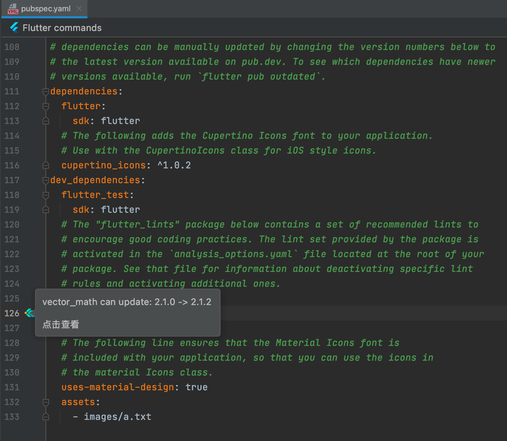
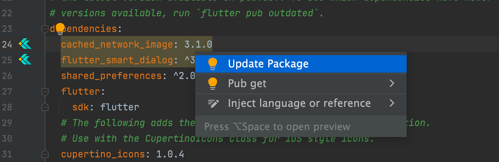

# 检查更新

## 概述

在 Flutter 项目中，依赖包的版本管理是一项持续性工作。手动逐个检查每个依赖的最新版本既耗时又容易遗漏。`iFlutter` 提供了自动版本检测功能，让依赖更新一目了然。

## 🔄 自动检测机制

`iFlutter` 会**每隔 5 分钟**自动检查项目中所有直接依赖的最新版本。当远程存在更新时，`pubspec.yaml` 文件中对应的依赖节点会**高亮显示**，提醒开发者关注。

## 🛠️ 使用方式

### 查看更新信息

将鼠标悬停在 `pubspec.yaml` 中**左侧高亮 Icon** 上，可以查看当前版本与最新版本的对比信息：

### 快速跳转仓库

点击**左侧高亮 Icon**，可以直接跳转到该包在 pub.dev 上的仓库页面，方便查看 CHANGELOG 和迁移说明。

### 一键升级

将光标停留在 `pubspec.yaml` 中对应的依赖版本号处，按下 `Option`（Windows / Linux：`Alt`）+ `Enter`，在弹出的快速修复菜单中选择 `Update Package`，即可完成版本升级：

## 📋 使用建议

- 升级前建议先查看包的 CHANGELOG，了解是否存在破坏性变更
- 重大版本升级（如 `1.x` → `2.x`）建议在单独分支上进行测试
- 升级后及时运行 `flutter pub get` 并执行回归测试
