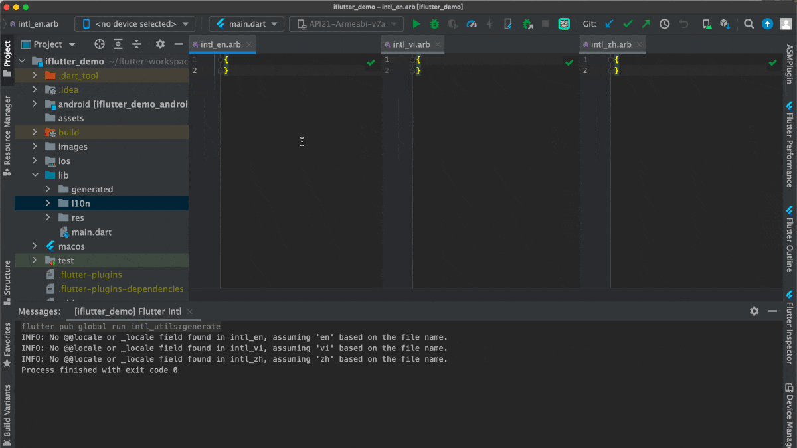
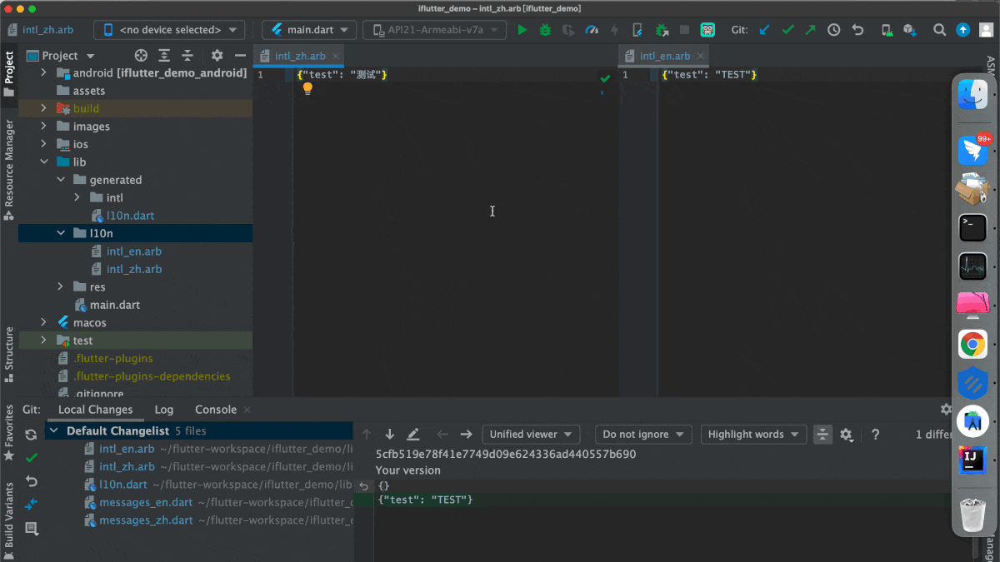
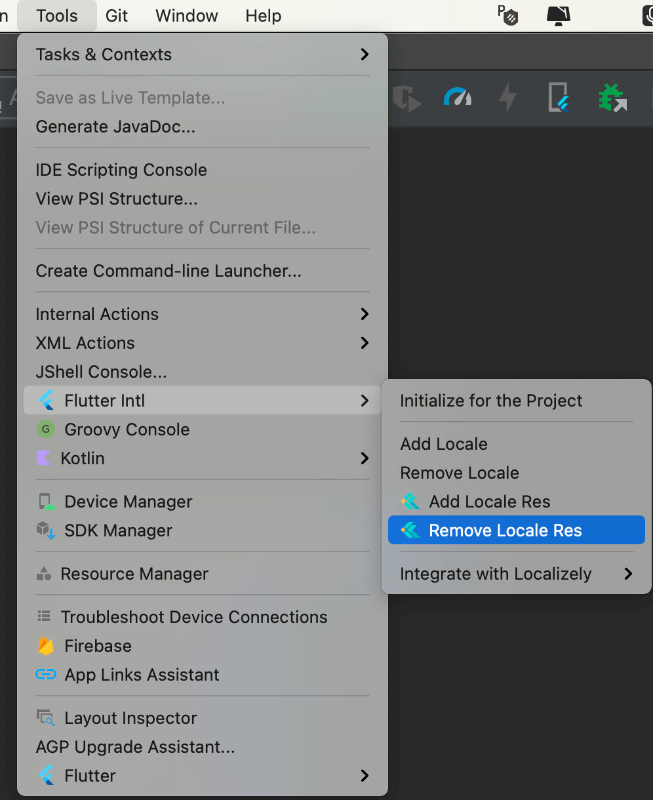
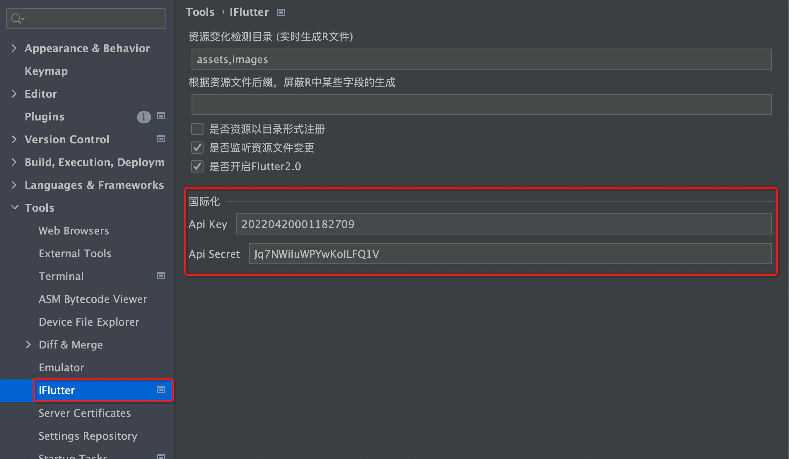

# 支持国际化

## 概述

当项目使用 `flutter_localizations` 支持国际化后，需要在不同语种的 `*.arb` 文件中手动添加字符资源，这个过程往往枯燥且容易出错。`iFlutter` 提供了智能的国际化资源管理功能，支持快速添加、移除国际化资源，并集成了自动翻译功能，大大提升了国际化开发的效率。

## 🚀 功能特性

### 智能管理

- **快速添加**：自动添加国际化资源到所有语言文件
- **自动翻译**：集成百度翻译，自动填充多语言内容

### 无缝集成

- **插件兼容**：与 `flutter_intl` 插件完美兼容
- **统一入口**：在 `flutter_intl` 功能入口处注入资源管理入口
- **工作流集成**：融入现有的国际化开发工作流

## 🛠️ 使用方法

### 添加资源

**快捷键：** `Option/Alt + A`

**使用步骤：**
1. **选择位置**：在需要添加国际化的位置使用快捷键
2. **输入键值**：输入资源的键名（key）
3. **填写内容**：在任意语言输入框中输入内容
4. **自动翻译**：切换光标后自动翻译其他语言
5. **确认添加**：确认后自动添加到所有 ARB 文件

### 移除资源

**快捷键：** `Option/Alt + R`

**使用步骤：**
1. **选择资源**：选择要移除的国际化资源
2. **触发移除**：使用快捷键或右键菜单
3. **确认操作**：确认要移除的资源
4. **自动清理**：自动从所有 ARB 文件中移除

## 🔧 插件集成

### flutter_intl 集成

如果当前 IDE 安装了 `flutter_intl` 插件，`iFlutter` 会在其功能入口处注入资源管理入口，提供统一的开发体验：

### 兼容性说明

- **完全兼容**：与 `flutter_intl` 插件完全兼容
- **功能增强**：在原有功能基础上增加便捷操作
- **无缝切换**：可以在两个插件之间无缝切换使用

## 🌐 自动翻译功能

### 功能介绍

从 `iFlutter-1.3.6` 版本开始，支持自动翻译功能。在添加资源界面的**任意** `locale` 输入框中输入内容后，切换光标时会自动通过百度翻译填充其他语言的内容。

### 配置要求

为了保证各个团队的翻译功能不受限制，需要配置百度翻译的 API 信息：

- **API KEY**：百度翻译 API 密钥
- **API SECRET**：百度翻译 API 密码

### 获取 API 密钥

1. **注册账号**：访问 [百度翻译平台](https://api.fanyi.baidu.com/product/11)
2. **创建应用**：创建新的翻译应用
3. **获取密钥**：复制 API KEY 和 API SECRET
4. **配置插件**：在 `iFlutter` 配置中填入密钥信息
