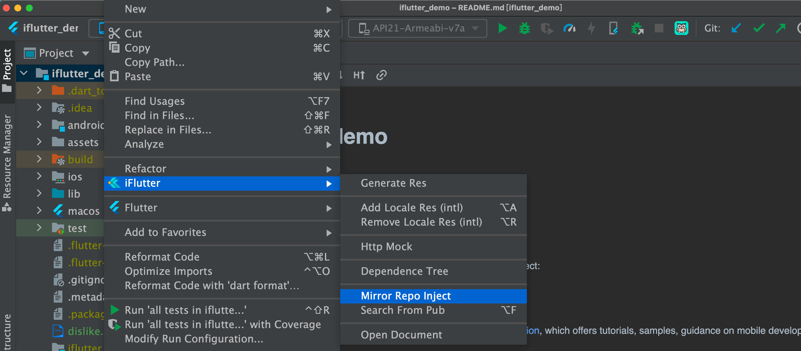
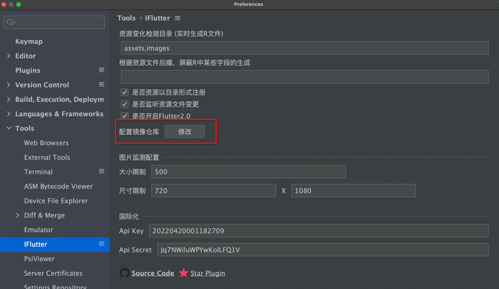
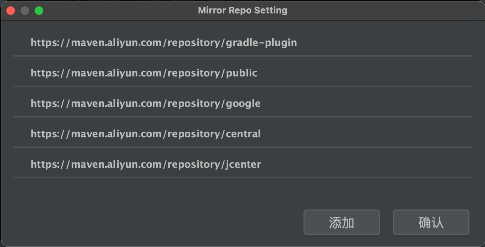

# 注入镜像仓库

## 概述

由于国内网络环境的限制，在编译 Flutter 项目时经常因为无法访问 Maven Central、Google 等境外仓库而导致编译失败。`iFlutter` 提供了一键注入镜像仓库的功能，自动为项目及所有 Flutter Plugin 的 `build.gradle` 添加阿里云等国内镜像，彻底解决编译依赖下载问题。

## 🚀 功能特性

### 批量注入

Flutter 项目通常会引入多个 Android Flutter Plugin，每个 Plugin 都有独立的 `build.gradle`。`iFlutter` 可以自动识别并批量注入所有 Plugin，无需逐一手动配置。

### 注入方式（v4.0.2+）

| 注入方式 | 说明 |
|---------|------|
| `inject to project` | 仅为根项目的 `build.gradle` 注入 |
| `inject to plugin` | 为所有 Android Flutter Plugin 的 `build.gradle` 注入 |
| `inject to flutter script` | 为 Flutter 编译脚本注入（`$flutterRoot/packages/flutter_tools/gradle/flutter.gradle`） |
| `inject all` | 以上位置全部注入（v4.0.2 之前的默认行为） |

## 🛠️ 使用方式

### 操作入口

> ⚠️ **注意**：引入新的 Android Flutter Plugin 后，在执行 `flutter pub get` 之后，需要重新执行一次注入操作，以确保新插件也应用了镜像配置。

## ⚙️ 配置说明

`iFlutter` 支持自定义镜像仓库列表，可在设置中新增或右键删除：

### 内置镜像仓库

| 镜像地址 | 对应仓库 |
|---------|---------|
| `https://maven.aliyun.com/repository/gradle-plugin` | Gradle Plugin |
| `https://maven.aliyun.com/repository/public` | Maven Central |
| `https://maven.aliyun.com/repository/google` | Google |
| `https://maven.aliyun.com/repository/central` | Maven Central |
| `https://maven.aliyun.com/repository/jcenter` | JCenter |
