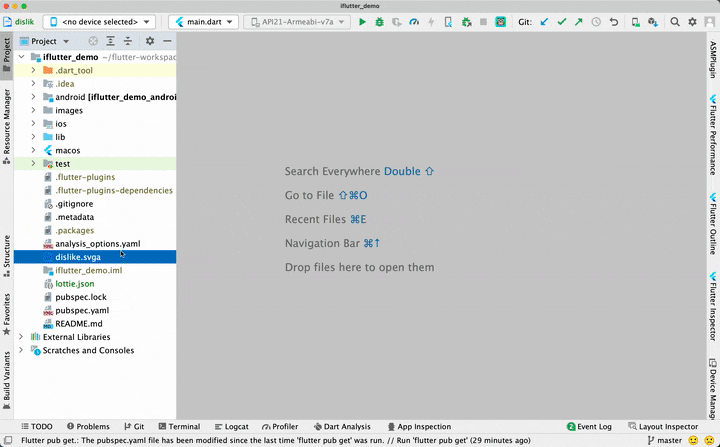
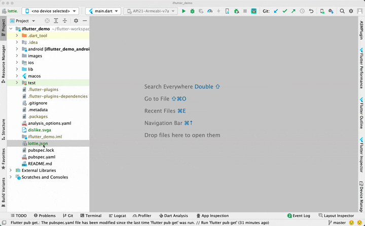

# MediaFilePreviewer 插件

## 概述

`MediaFilePreviewer` 是一款独立的 IntelliJ IDEA / Android Studio 插件，专注于加强 IDE 对媒体文件的预览支持。支持 SVG、SVGA、Lottie、WebP 等常见格式，让开发者无需离开 IDE 即可查看动画和图片效果。

## 📦 安装方式

在 IDE 插件市场中搜索 **MediaFilePreviewer** 即可安装。

## ⚠️ 兼容性说明

自 `IDEA 2025.1.1` 起，官方不再支持 `JavaFX`。如需在该版本及以后的 IDE 上正常使用此插件，请确认已切换到支持 JCEF 的 JBR 版本。详见：[切换 JBR](../chapter-9/part-1.md)

## 🎯 功能清单

- 支持 `SVG` 文件预览
- 支持 `WebP` 文件预览
- 支持 `SVGA` 动画预览
- 支持 `Lottie` 动画预览
- 支持预览缩放（`Ctrl` / `Command` + 滚轮）
- 兼容 IDEA 明暗不同主题

> 💡 可在 `Settings` → `Tools` → `MediaFilePreview` 中关闭动态图片的自动播放。

## 🖼️ 效果展示

### SVGA 文件预览

### Lottie 文件预览

