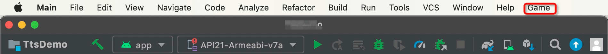

<!-- Plugin description -->
GameCenter is an IDEA Plugin for Developer to play Games
<!-- Plugin description end -->

   

## 项目说明

为了缓解日复一日枯燥编程带来了的压力，由此`Game Center`插件诞生。`Game Center`顾名思义，是在`IDEA`中集成一个游戏菜单，方便开发同学工作之余使用。

## 使用截图



## 游戏列表

- FlappyBird - 从项目 [FlappyBird](https://github.com/kingyuluk/FlappyBird) 进行移植

- FC游戏 - [游戏清单](https://github.com/YangLang116/nes-game-list) 按键说明如下：

|  按键  | player1 | player2 |
| :----: | :-----: | :-----: |
|  Left  |    A    |  Num-4  |
| Right  |    D    |  Num-6  |
|   Up   |    W    |  Num-8  |
|  Down  |    S    |  Num-2  |
|   A    |    J    |  Num-7  |
|   B    |    K    |  Num-9  |
|   AA   |    Z    |  Num-/  |
|   BB   |    X    | Num-\*  |
| Start  |  Enter  |  Num-1  |
| Select |  Ctrl   |  Num-3  |


## 重点说明

如果当前IDEA支持 [JCEF](https://plugins.jetbrains.com/docs/intellij/jcef.html) ，FC游戏会在IDEA中直接打开，否则只能借助系统浏览器运行。
默认情况下，Intellij IDEA 支持JCEF的，而AndroidStudio
不支持，如果想要打开IDEA的JCEF功能，请参考文档 [如何打开JCEF?](https://yanglang116.github.io/iFlutter/content/chapter-9/part-1.html)

---

## 插件扩展

考虑该插件的扩展性，降低后期的开发成本，方便更多的游戏集成。`Game Center` 支持将每一个游戏以 `jar` 文件的形式进行引入。

### 开发环境要求

- java 11

### 开发步骤

- 1、编写Swing游戏
- 2、引用 `GameCenterBase.jar`依赖(可选)

```
GameCenterBase 依赖包，提供音频播放、数据存储功能：

数据存储：

GameCenterFacade<? extends GameCenterService> gameCenterFacade = GameCenterFacade.getInstance();
StorageService storageService = gameCenterFacade.getStorageService();
storageService.save(key,value) / storageService.read(key)

音频播放：

GameCenterFacade<?> gameCenterFacade = GameCenterFacade.getInstance();
AudioService audioService = gameCenterFacade.getAudioService();
InputStream audioStream = getResourceAsStream(assetPath);
audioService.play(audioStream);
```

- 3、为Swing游戏添加指定入口函数，以便 `Game Center` 能运行该游戏
    ```
    public static void runGame() {
      ...
    }
    ```

- 4、将编写的Swing游戏导出成jar文件

- 5、注入游戏到 `Game Center` IDEA插件
    - 将第4步生成的jar，放入项目根目录的`libs`文件夹
    - 在`src/main/resources/game/swing/conf.properties` 中配置游戏，格式如下：

  ```
  Game Name=runGame 函数所在的类的FQN，例如：FlyBird=com.kingyu.flappybird.app.App
  ```

- 6、将Swing游戏的源代码，放入到 `game-list` 中(可选)

- 7、提交PR，游戏运行无误，即可发布上市场
