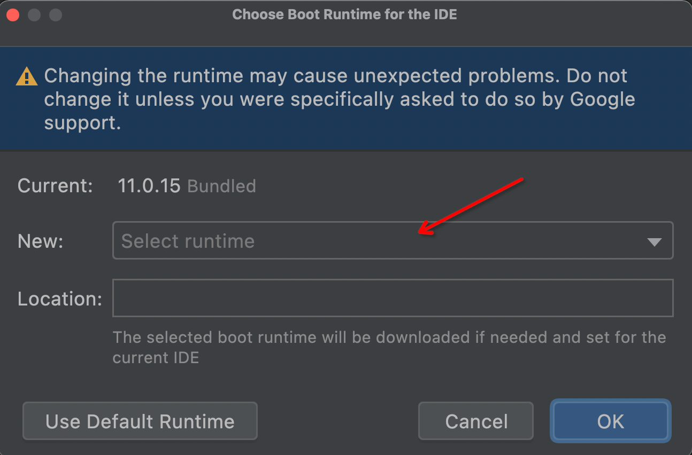

# 切换 JBR

## 概述

JBR（JetBrains Runtime）是 IntelliJ IDEA 系列 IDE 使用的 Java 运行时环境。部分插件功能（如 `MediaFilePreviewer` 的媒体文件预览）依赖 JCEF（Chromium Embedded Framework）支持，需要切换到包含 JCEF 的 JBR 版本才能正常使用。

## 🛠️ 切换步骤

1. **打开 Action 搜索**：双击 `Shift` 键，切换到 `Actions` 标签页
2. **搜索命令**：在输入框中输入 `Choose Boot Java Runtime for the IDE`（输入 `Choose Boot` 即可匹配）
3. **选择版本**：在弹出窗口中选择名称包含 **`JetBrains Runtime with JCEF`** 的版本
4. **确认并重启**：点击 `OK`，等待下载完成后重启 IDE

## 📋 适用场景

| 场景 | 说明 |
|------|------|
| `MediaFilePreviewer` 无法预览 | IDEA 2025.1.1+ 默认不含 JCEF，需手动切换 |
| `Game Center` FC 游戏内嵌显示 | AndroidStudio 默认不支持 JCEF，需手动切换 |
